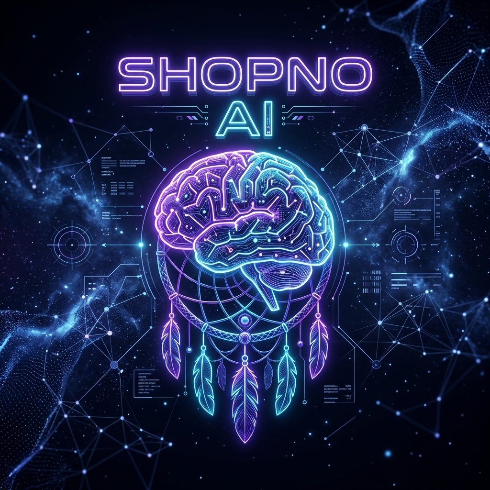
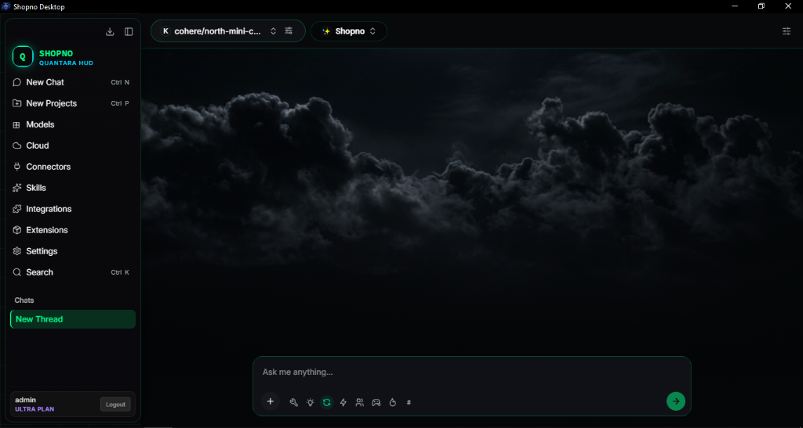

<div align="center">
  
  
  # 🌌 SHOPNO AI v2.0 Desktop Edition
  
  ### The Sovereign Autonomous AI & Multi-Agent Swarm Operating System
  **454+ Native Tools • 4,000+ Skills • 60,000+ Open VSX Extensions • 7 Billion Tokens Freedom • 1-Click MCP Suite**

  [](https://github.com/CyberPrince-glitch/Shopno-Portable-LLM/releases/latest)
  [](https://surveymentor.org)
  [](https://surveymentor.org/)
  [](https://surveymentor.org/)
  [](https://surveymentor.org/)
  [](https://chromewebstore.google.com/detail/shopno-browser-agent/fcaobmifkhmhdphiolacoejcgjgcieid)
  [](https://github.com/CyberPrince-glitch)
  [](LICENSE.md)

  <br><br>

  <a href="https://github.com/CyberPrince-glitch/Shopno-Portable-LLM/releases/latest/download/Shopno%20Desktop_2.0.0_x64-setup.exe">
    
  </a>
  <a href="https://surveymentor.org/">
    
  </a>
  <a href="https://chromewebstore.google.com/detail/shopno-browser-agent/fcaobmifkhmhdphiolacoejcgjgcieid">
    
  </a>

</div>

---

<div align="center">
  
  <p><i>Live Desktop Preview: Quantara Cyberpunk HUD with Emergent Atmospheric Cloud Engine, Multi-Model Routing & Tool Calling</i></p>
</div>

---

> **"Stop chatting with toy chatbots. Start commanding a sovereign, multi-agent digital workforce."**
> 
> **Shopno AI Desktop** is an all-in-one autonomous AI desktop operating system built on Tauri & Rust. It unifies **454+ native tools**, **4,000+ built-in skills**, **60,000+ Open VSX extensions**, a **7-Billion monthly token mesh**, the **official Model Context Protocol (MCP)**, **Docker sandbox security**, and **multi-agent swarm intelligence** under an emergent **Atmospheric Cloud HUD**.

[📥 Direct Download (Windows x64)](#-direct-download--promo-code) • [🎥 Video Demos](#-live-video-demonstrations) • [⚡ Feature Tour](#-visual-feature-deep-dive) • [🇧🇩 সম্পূর্ণ বাংলা রিভিউ](#-বাংলা-রিভিউ-ও-ব্যবহার-নির্দেশিকা) • [👑 Meet the Architect](#-meet-the-architect)

---

## 🎥 Live Video Demonstrations

See Shopno AI in action building complete games and running complex development workflows in minutes:

<table align="center" width="100%">
  <tr>
    <td width="50%" align="center">
      <a href="https://youtu.be/rH87TOWSrXM">
        <br>
        <b>🎮 Fruit Ninja & GTA Vice City Built in 5 Mins</b>
      </a>
      <p>Watch Shopno generate full games from scratch with complete logic, assets, and controls.</p>
    </td>
    <td width="50%" align="center">
      <a href="https://youtu.be/uCNAzU7Di-U">
        <br>
        <b>⚙️ Setup, Subscription & Free Models Config</b>
      </a>
      <p>Complete walkthrough on setting up offline models, free providers, and enabling tools.</p>
    </td>
  </tr>
</table>

---

## ⚡ Visual Feature Deep Dive

Shopno Desktop is packed with groundbreaking superpowers that replace dozens of expensive monthly subscriptions:

### 1. 🌌 7 Billion Monthly Token Freedom & Hybrid Engine
No artificial throttles. Use up to **7 Billion tokens/month** with zero restrictions. Switch effortlessly between free API providers, custom keys, or direct API-less models. Even if cloud models are overloaded, you never stop working.
<div align="center">
  
</div>

---

### 2. 🔒 Air-Gapped & 100% Offline Local Model Inference
Turn off your internet and keep coding. Download optimized offline local models tuned to your CPU/GPU hardware (CUDA, Vulkan, ROCm, DirectML). Absolute privacy, zero cloud telemetry, 100% sovereign data.
<div align="center">
  
  
</div>

---

### 3. 🎨 Instant Multi-Modal Vision & Image Studio
Generate images, analyze UI screenshots, process diagrams, and edit visuals in seconds directly from the chat interface without external third-party subscriptions.
<div align="center">
  
</div>

---

### 4. 🤖 300+ Specialized Autonomous Agent Assistants
A massive fleet of 300+ battle-tested domain agents ready to 10x your productivity across software engineering, security auditing, DevOps, creative writing, reverse engineering, and digital marketing.
<div align="center">
  
</div>

---

### 5. 🐙 Official Model Context Protocol (MCP) Ecosystem
Add custom, community, and marketplace MCP servers with one click. Seamlessly connect GitHub, PostgreSQL, local filesystems, Docker, Brave Search, and any API into Shopno's cognitive core.
<div align="center">
  
</div>

---

### 6. 🐝 Multi-Agent Swarm Studio
Orchestrate unlimited custom agent swarms. Assign specialized roles (Architect, Coder, Reviewer, Tester) with independent system prompts and distinct LLM backends collaborating concurrently to solve massive software problems.
<div align="center">
  
</div>

---

### 7. 🎭 Universal AI Workspace Emulation
Love the interface or behavior of Lovable, Emergent, Cursor, Claude, Replit, v0, Devin, or Google AI Studio? Shopno can emulate any platform persona and model behavior locally with zero subscription fees.
<div align="center">
  
</div>

---

### 8. 🧪 Shopno Distillation Studio
Generate high-quality synthetic training datasets from frontier models and fine-tune smaller local models on your own machine. Test and evaluate your customized distilled weights directly inside the studio.
<div align="center">
  
</div>

---

### 9. 🧩 60,000+ Open VSX Extensions & Local Hosting
Access the vast Open VSX marketplace without Microsoft vendor lock-in. Turn your local machine into a local AWS cluster, dev server, or isolated staging sandbox with one prompt.
<div align="center">
  
</div>

---

### 10. 🐳 Docker Sandbox Safety Mode
Protect your host filesystem. Run untested or untrusted AI code inside isolated virtual Docker containers. When turned off, Shopno gains full native terminal control for deep system automation.
<div align="center">
  
</div>

---

### 11. ⚙️ Triple Super-Engine Architecture
Three specialized execution cores dynamically optimize execution speed, cognitive reasoning depth, and memory consumption based on the task complexity.
<div align="center">
  
  
</div>

---

### 12. 📚 4,000+ Built-in Skills Ecosystem
Browse and trigger over 4,000 built-in skills across mathematics, web scraping, bioinformatics, machine learning, and DevOps. Create, export, or import custom skills effortlessly.
<div align="center">
  
</div>

---

### 13. ☁️ Dynamic Cloud Model Routing & Failover Mesh
Real-time status of all active cloud models. If a provider rate-limits or experiences an outage, Shopno automatically reroutes prompts to the next best available engine.
<div align="center">
  
</div>

---

### 14. 👁️ Autonomous Tool Calling & Vision Toggles
Unlock full autonomous agency: toggle Tool Calling so the model can inspect files, write scripts, execute commands, and browse the web. Toggle Vision for deep visual comprehension of images, videos, and UI layouts.
<div align="center">
  
  
</div>

---

### 15. 💼 Universal Business & Freelance Automation
Replace N8N, Zapier, and IFTTT. Automate social media marketing, build complete desktop & mobile apps, manage e-commerce storefronts, and automate repetitive tasks that make you money while you sleep.
<div align="center">
  
</div>

---

## 🇧🇩 বাংলা রিভিউ ও ব্যবহার নির্দেশিকা

<div align="center">
  
</div>

### Shopno AI Desktop Version এর রিভিউ আর্টিকেলে স্বাগতম!
আজকের রিভিউতে তুলে ধরার চেষ্টা করবো নতুন এবং অত্যন্ত শক্তিশালী একটি অল-ইন-ওয়ান এআই অপারেটিং সিস্টেম—**Shopno AI Desktop Version**।

স্বপ্ন ডেস্কটপ টুলসটি এমন একটি এআই টুল যা শুধু চ্যাট (যেমন ChatGPT), শুধু ইমেজ বানানো (যেমন Midjourney, Leonardo), শুধু ভিডিও বানানো (যেমন Kling, Runway), অথবা শুধু কোডিং (যেমন Codex, Claude Code)-এর মত এক ধরনের কাজের ওপর নির্ভরশীল নয়। বরং সবগুলো সিস্টেম আপনি **এক জায়গা থেকেই** কমান্ড দিয়ে ব্যবহার করতে পারবেন!

#### 🔥 আনলিমিটেড টোকেন ও স্বাধীনতা:
সাধারণত যেসব এআই আপনারা ব্যবহার করেন তার অধিকাংশই পেইড অথবা ফ্রি হলেও কড়া লিমিটেশন থাকে। শপ্নো ডেস্কটপে আপনি প্রতি মাসে **৭ বিলিয়ন টোকেন** পর্যন্ত ব্যবহারের অবাধ স্বাধীনতা পাবেন। এখানে রয়েছে ফ্রি এপিআই কিংবা এপিআই-লেস উভয় সিস্টেমে কাজ করার পূর্ণ সুবিধা। কোনো মডেল ওভারলোডেড থাকলেও নিমেষেই অল্টারনেটিভ প্রোভাইডারে সুইচ করা যায়।

#### ⚡ অফলাইন লোকাল এআই:
আপনার ডিভাইসের কনফিগারেশন অনুযায়ী অফলাইন মডেল ডাউনলোড করে ইন্টারনেট ছাড়াই চালাতে পারবেন। ইন্টারনেট চালু থাকুক বা বন্ধ—কাজ চলবে অবিরাম।

#### 🎨 সেকেন্ডের মধ্যে ইমেজ ও মিডিয়া জেনারেশন:
আলাদা কোনো ওয়েবসাইটে না গিয়ে চ্যাটবক্স থেকেই প্রম্পট দিয়ে হাই-কোয়ালিটি ইমেজ তৈরি ও প্রসেস করা সম্ভব।

#### 🤖 ৩০০+ স্পেশাল এজেন্ট ও Swarm Studio:
ডেভেলপমেন্ট, সিকিউরিটি অডিট, কন্টেন্ট ক্রিয়েশনসহ প্রায় সব কাজের জন্য ৩০০+ বিল্ট-ইন এজেন্ট রয়েছে। আর Swarm Studio-র মাধ্যমে আপনি আপনার প্রোজেক্ট অনুসারে কাস্টমাইজড একাধিক এজেন্টকে একসাথে একযোগে কাজে লাগাতে পারবেন।

#### 🎭 যে কোনো জনপ্রিয় প্ল্যাটফর্মের ফিল এক জায়গায়:
আপনি যদি Loveable, Emergent, Replit, Cursor, Codex, Claude, Google AI Studio কিংবা Devin ব্যবহার করে থাকেন, তবে Shopno সেগুলোর পার্সোনা ও কাজের ধারা নিখুঁতভাবে এমুলেট করতে পারে।

#### 🧪 Shopno Distillation Studio:
নিজের তৈরি এআই মডেলকে ফাইন-টিউন করার জন্য ডেটাসেট তৈরি করা এবং মডেলের পারফরম্যান্স সরাসরি লোকাল মেশিনে টেস্ট করার জন্য রয়েছে ডেডিকেটেড ডিস্টিলেশন স্টুডিও।

#### 🧩 এক্সটেনশন ও ডকার স্যান্ডবক্স:
৬০,০০০+ ওপেন-সোর্স VS Code এক্সটেনশন ব্যবহারের সুবিধা রয়েছে। পাশাপাশি ডকার ইন্সটল থাকলে স্যান্ডবক্স মোডে নিরাপদ ভার্চুয়াল স্টোরেজে কোড রান করা যায়, ফলে কোনো রিস্ক থাকে না।

#### 💼 ফ্রিল্যান্সিং ও অটোমেশন পাওয়ারহাউস:
স্বপ্নতে রয়েছে **৪৫৪+ বিল্ট-ইন টুলস**, যা দিয়ে **৫,০০০+ ধরনের কাজ** করা সম্ভব। এটি N8N, Zapier, এবং IFTTT-এর নিখুঁত অল্টারনেটিভ। ফ্রিল্যান্সিং প্রোজেক্ট, অ্যাপ, গেমস, এক্সটেনশন বা ফুল বিজনেস ম্যানেজমেন্ট—সবকিছুই স্বপ্ন স্বয়ংক্রিয়ভাবে হ্যান্ডেল করতে সক্ষম।

---

## 📥 Direct Download & Promo Code

| প্ল্যাটফর্ম | বিবরণ ও লিংক |
|---|---|
| **Windows 64-bit Installer** | [**Download Shopno Desktop v2.0.0 (.exe)**](https://github.com/CyberPrince-glitch/Shopno-Portable-LLM/releases/latest/download/Shopno%20Desktop_2.0.0_x64-setup.exe)
| **Windows MSI Installer (.msi)** | [**Download Shopno Desktop v2.0.0 (.msi)**](https://github.com/CyberPrince-glitch/Shopno-Portable-LLM/releases/latest/download/Shopno%20Desktop_2.0.0_x64_en-US.msi) |
| **১০০% ডিসকাউন্ট প্রোমো কোড** | `SHOPNO` *(সম্পূর্ণ ফ্রিতে লাইসেন্স অ্যাক্টিভ করার জন্য)* |
| **অফিসিয়াল ওয়েবসাইট** | [**Surveymentor.org**](https://surveymentor.org/) |
| **Official Landing Page (Web)** | [**cyberprince-glitch.github.io/Shopno-Portable-LLM**](https://cyberprince-glitch.github.io/Shopno-Portable-LLM/) |
| **Shopno Browser Agent (Chrome Extension)** | [**Install from Chrome Web Store**](https://chromewebstore.google.com/detail/shopno-browser-agent/fcaobmifkhmhdphiolacoejcgjgcieid) |
| **গিটহাব রিলিজ পাতা** | [**All Releases**](https://github.com/CyberPrince-glitch/Shopno-Portable-LLM/releases) |

---

## 👑 Meet the Architect

```text
+------------------------------------------------------------+
|           CYBER PRINCE (SOUROV) -- AI ARCHITECT            |
+------------------------------------------------------------+
|                          #@@                               |
|                      ####@@@@@@@@@@               =        |
|                ## ####@@@@@@@@@@@@@@@@@           +        |
|              * *#######@@@@@@@@@@@@@@@@@#         =        |
|           -+ ###################@@@@@@@@@#+       **       |
|             #######+==--------=+#####@@@@@#      ****      |
|            ######+---------------=++##@@@@@+     *****     |
|           ######+------------------==##@@@##     *****     |
|           #####+---=====------------==##@@#+-     *****#   |
|           #####=--=+====++====-----===##@#*+=    ***##+=   |
|           #####-----========--=-=+++####@##*= =**#++====-  |
|           **#*#---=-======+----++=****##@##====++======+   |
|           ++#*+--=====++++=---====#***####+-------====+    |
|           -=**=---------------=+=+++=***##=-------=== +*   |
|            =*#=--......-------=-=---+==*#+------===  +     |
|            +=+----....----------=----===+=---===== =++     |
|             +=--------===+++==++=--=====---===== =-=+=     |
|             ==------=+=====*****++++===---=====+++-=+=*=   |
|              =-----=+=======*****#+===---========+=+=**    |
|              ------===+++++==*****====--=========+++=*     |
|              -----=+=+====+===***=+==--====+++==+=*=*      |
|           .=*-----+===+++++++##**+=--======+  +==**        |
|           .:*+=---=++************=-=-=====++--+++=*=#      |
|            :#=------==++=*******+:.:=======----=+          |
|    .:.      :====-------++++++**+...:=--==---=-            |
|   ....       =====--------===+**+....:==---== =            |
|    :.:.:      =+==-=-------==+=#:.....:---=------==        |
|    ..:...      :+======------=+:..  ...=-=..........:      |
|     .:....:     ::+======----=: . .....:::...........:     |
|     ..:.....      :=-==----=::   ......:.:............     |
|     ..:......:::  .::=----=:     .......::............     |
|      ..:   :...::  ...:=-=:.     .....................     |
|     :..:    :...::.....::...:::.......................     |
|     :..:     ...::.......:...:...   ..................     |
+------------------------------------------------------------+
```

**Cyber Prince (Sourov)**  
*Visionary AI Architect, Full-Stack Engineer & Cyber-Security Researcher*

[](https://www.facebook.com/ImDarkMagician/)
[](https://github.com/CyberPrince-glitch/)
[](https://surveymentor.org/)
[](https://github.com/CyberPrince-glitch/)

> *"Shopno AI was built to bring your digital dreams into reality. 454+ tools. 4,000+ skills. 7 billion tokens of freedom. One sovereign desktop operating system. Build without limits."*  
> — **Cyber Prince**

---

## 📜 Open Source License

This project is licensed under the **MIT License**. You are free to use, modify, distribute, and build upon this foundation.

See [LICENSE.md](LICENSE.md) for full terms.

---

<p align="center">
  <b>⭐ If Shopno AI elevates your productivity, star this repository on GitHub! ⭐</b><br>
  <sub>Built with ❤️, precision Rust engineering, and relentless passion by <a href="https://github.com/CyberPrince-glitch">Cyber Prince</a>.</sub>
</p>
